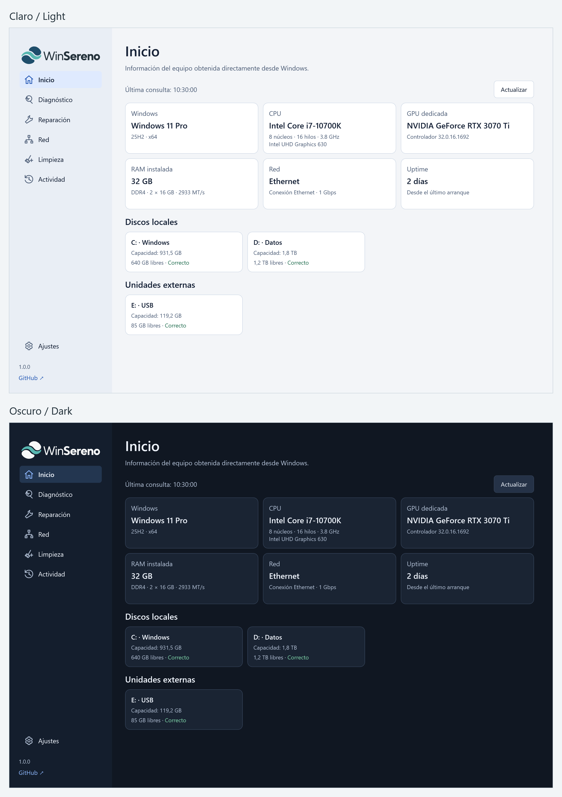

  

  <a href="README.md">Español</a> · <strong>English</strong>

  
  
  
  

  WinSereno brings Windows diagnostics, maintenance, and repair tools together in a clear, portable interface. You choose what to run and can review the results.

  

  <strong>Portable · No installation · Native Windows tools</strong>

  
   
  Theme preview with sample data (screenshot from 1.0.0). The interface is available in Español and English.

## What is WinSereno?

WinSereno provides one place to check your PC's condition and use Windows tools such as DISM, SFC, and CHKDSK. It puts diagnosis and explicit actions first, asks for confirmation before making changes, and lets you inspect the results.

The focus is maintenance under your control, without speed claims or opaque “PC optimizer” tweaks. It never restarts or shuts down Windows automatically.

## Features

| Area | What you can do |
| --- | --- |
| Home | View Windows, CPU, GPU, RAM, network, and uptime information. See local disks and external drives that Windows identifies as removable in separate sections. |
| Diagnostics | Check storage space and basic disk health, network and Internet connectivity, critical services, events, and Windows integrity through DISM CheckHealth and SFC VerifyOnly. **No repairs are applied.** |
| Repair | Run DISM CheckHealth, ScanHealth, and RestoreHealth; SFC; component cleanup; and a conditional full repair sequence. Includes read-only CHKDSK, without repairing or scheduling repairs. |
| Network | Inspect adapters, flush the DNS cache, renew DHCP, restart an adapter, and reset Winsock or TCP/IP. TCP/IP reset checks IPv4 and requires a second confirmation for manual or undetermined configurations. |
| Cleanup | First analyze user and Windows temporary files, the thumbnail cache, and the Recycle Bin. Clean categories with valid analysis results using a conservative policy; the Recycle Bin is unchecked by default. |
| Activity | Review actions, results, and details from the current session. TXT logs provide the persistent record. |
| Settings | Choose Light, Dark, or System and the Español or English interface; open the application and log folders; view application information and project links; and reset preferences. Theme and language are saved independently. |

Some information depends on hardware, drivers, and permissions. Cleanup estimates do not guarantee how much space will be freed. TCP/IP reset does not automatically back up or restore network settings.

## How to use it

1. [Download the latest stable release](https://github.com/joseamc91/WinSereno/releases/latest).
2. Place `WinSereno.exe` in a writable local folder.
3. Run the application and choose a section.
4. Review the information and warnings before confirming an action.

Some operations request administrator privileges through UAC. The application starts with normal permissions and does not automatically run cleanup or repairs.

## Portable

WinSereno does not need an installer. Settings (`config.json`) and logs (`Logs/`) are stored beside the executable in its own folder.

You can move the application by keeping the whole folder together. Review logs before sharing them: they may contain information about your PC.

## Compatibility

- Windows 10 and Windows 11.
- .NET Framework 4.8.
- A writable local folder.

The interface is available in Español and English. Switch languages in Settings without restarting; your choice is saved between sessions.

## Safety

Actions that change the system require confirmation; some also require UAC. WinSereno never restarts or shuts down the PC automatically and does not disable Windows protections.

The executable does not yet have a commercial code-signing certificate or an Authenticode signature. On some PCs, Smart App Control may block it because its publisher cannot be verified. We do not recommend disabling protections or adding exclusions to bypass that block.

## Roadmap

Future plans, guided by usage and feedback:

- In-app update checking and installation.
- Improvements based on users' experience.

## Documentation

- [Changelog](CHANGELOG.en.md)
- [GNU GPLv3 license](LICENSE)
- [Technical notes on administrative execution](AUDIT_PRIVILEGED_EXECUTION.md) (Spanish)
